# A BEGINER’S PRACTICAL GUIDE TO DEVOPS
### _LEARN DEVOPS BY DEPLOYING A SAMPLE APPLICATION_
For a new or aspiring joiner in DevOps, the sheer breadth of the technology stack can feel overwhelming and it may be difficult to connect everything to together to see the end picture. The best way to learn DevOps isn’t by memorising tools or watching endless tutorials. It’s by building something real. So instead of giving you another abstract explanation, this tutorial drops you straight into the real thing with a DevOps project that you can replicate at zero cost. You’ll build, deploy and monitor an actual application, just like a DevOps engineer would on the job. This guide walks you through the entire process step by step, with complex concepts broken down clearly and best practices highlighted along the way.

> [!NOTE]
> This tutorial is a deep dive for beginners. Don't rush! I recommend breaking it into multiple sessions to ensure the concepts really stick.

## OVERVIEW OF PROJECT
The project consists of the following components:
-   A simple ‘welcome to devops’ application written in java,
-   A pipeline to create infrastructure through Infrastructure as code that the application will be deployed on,
-   A CI/CD pipeline to build and test the application, package it into a Docker container and deploy it to a target infrastructure,
-	A pipeline to create infrastructure to monitor the deployed application, and 
-	Pipelines to destroy created infrastructure once you have completed the project and are no longer actively working on it.

## DEVOPS COMPONENTS YOU WILL LEARN
The project in this repository touches on core components like:
-	Source code version control,
-	Secret management,
-	Continuous integration and Continuous delivery/deployment (CI/CD),
-	Infrastructure as code,
-	Dependencies scanning,
-	Vulnerabilities scanning,
-	Application versioning
-	Artifacts management,
-	Containerization and Container Orchestration (Abstracted Kubernetes for simplicity),
-	Monitoring.

> [!WARNING]
> - In this tutorial, I’ve stripped down the jargon to give you a clear mental model of DevOps.
> - The goal is to help you understand the "why" and "what" of each component and see examples of tools in action.
> - While this gets you started quickly, it does not replace the need for deep technical mastery of tools and components as you grow.

Now Let’s dive into deploying your own version of the project. I enjoyed creating this project. I hope you enjoy replicating it and even go further to creating your own unique projects.

## DEPLOYING YOUR OWN VERSION OF THE PROJECT
### Fork the Repository
The first thing you need to do is to fork the project.

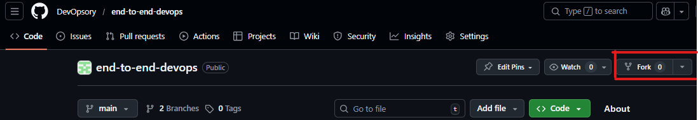

If you are unfamiliar with GitHub, A simple explanation is that it is a solution for storing your code plus associated files and changes you make to them over time. It is based on Git, a version control system that tracks changes in any directory where it is initialized. To fork this repository, you must first create your own [GitHub account](https://github.com/signup).

When you fork a repository, GitHub copies the content of that repository to your own GitHub account. The content of your forked repository should be an exact copy of this repository. Your repository should contain the app code, infrastructure code, cicd pipelines and other files.

In practice, keeping your application code and infrastructure configuration in the same repository is considered poor practice. I kept them in the same repository to make this project easy for beginners to follow. The app folder contains the application code and container image definition. The infra folder contains the deployment infrastructure code and the monitoring folder contains the monitoring infrastructure code. It is a best practice to separate monitoring infrastructure from the deployment infrastructure. This helps facilitate detection of issues independently of the systems or applications being monitored, reduces risk and improves performance.

### Setup Secrets Management
Secrets management is an important concept in DevOps that looks at the secure handling of credentials used in pipelines. I collected some data driven reports to show you the importance of proper credential handling and give you an idea of how devastating badly handled credentials can be. A 2025 data analysis by [GitGuardian](https://www.gitguardian.com/state-of-secrets-sprawl-report-2025) revealed that about 23.8 million new secrets were detected in public GitHub commits in 2024 (+25% from the previous year). Leaked secrets, when they get into the hands of bad actors can lead to severe consequences like data breach. [A study at IBM](https://www.ibm.com/reports/data-breach) currently estimates the global average cost of data breach to be $4.4M.

The easiest method of secrets handling is using GitHub Secrets which hosts secrets within a repository. In practice, organizations find this insufficient for many good reasons. To give you one very simplified example, imagine a hacker gets into your organization’s GitHub repo, they don’t just steal your code; they find the keys to your actual house. With those stored secrets, they can log into your infrastructure, delete your databases, or steal customer data, turning a 'code leak' into a total business shutdown. To ensure tight security in adherence to best practices, organizations use a self-hosted secrets management platform. To help you understand what this feels like in real practice, the pipelines in this project use secrets stored in a free vendor-hosted secret management account from Doppler. The downside to using a free account is that your secrets are stored with the vendor and fetching those secrets requires a token that we need to store in GitHub Secrets. Nevertheless, this implementation gives you a feel of how secrets are managed in DevOps pipelines.

Create a free account on https://www.doppler.com. Once in your account, go to projects and create a new project called sample-project.

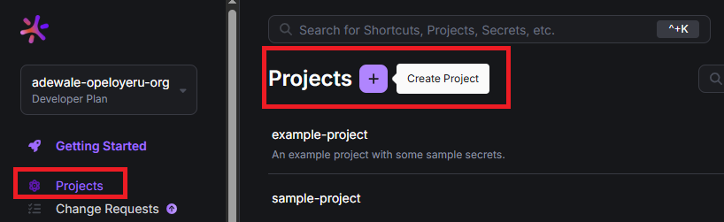

The project should contain dev, stage and prod environments by default. You will store your secrets in the dev environment. Go to the dev environment -> access -> generate, to generate a service token.

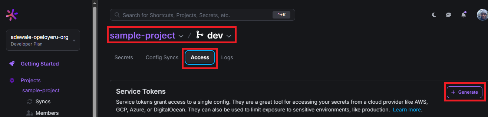

Add the service token as a secret named DOPPLER_TOKEN in actions variables in your own fork of this repository. Click on Settings -> Secrets and Variables -> Actions -> New repository secret.

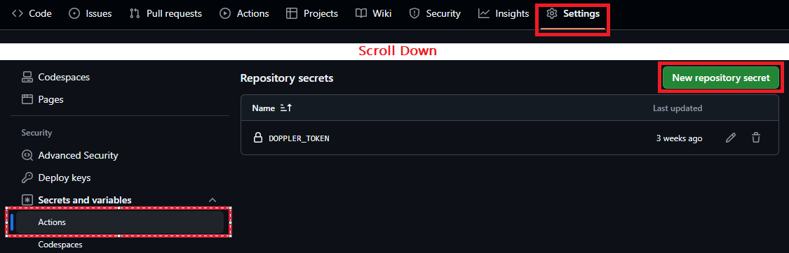

### Create Deployment Infrastructure
Think of the deployment infrastructure as the computer on which your application will run. The computer will be hosted in the cloud. Cloud Computing is the process of using computers provided by Cloud Providers to run applications and services in exchange for a fee. Businesses and engineers don’t have to host physical computers, servers or data centres. One obvious advantage of this is that you can choose to pay for computing resources only when you need them and don’t need to worry about the purchase or maintenance of physical computing resources. According to research by [Gitnux](https://gitnux.org/cloud-industry-statistics/), over 90% of enterprises are using cloud services in some capacity with nearly 60% of companies seeing cost savings as the primary benefit of running applications in the cloud.

The deployment infrastructure in this project is defined as code using Terraform. Terraform is an Infrastructure as Code (IaC) language, developed by Hashicorp and is widely used in the DevOps practice. One big advantage of using infrastructure as code is that it streamlines, standardizes and automates infrastructure creation. Imagine you want to create hundreds of servers in the cloud, doing this on the cloud provider’s UI will be error prone and grossly inefficient. IaC tools like Terraform can help you automate and streamline such tasks. If you are interested in learning more about how industries adopt IaC, you can look at the report by [Grand View Research](https://www.grandviewresearch.com/industry-analysis/infrastructure-as-code-market-report).

To align the infrastructure creation with DevOps best practices, a pipeline named create_infra.yml has been written and stored in the .github/workflows folder. To be able to run the pipeline to create the infrastructure, there are some prerequisites that you must complete.

#### Prerequisites
First, create a free IBM Cloud account, https://cloud.ibm.com. Then, create an API key named IBMCLOUD_API_KEY by clicking `Manage` -> `Access (IAM)` -> `API Keys` -> `Create`. Make sure you copy the key somewhere safe as you will need to add it to your Hashicorp account which you will create next.

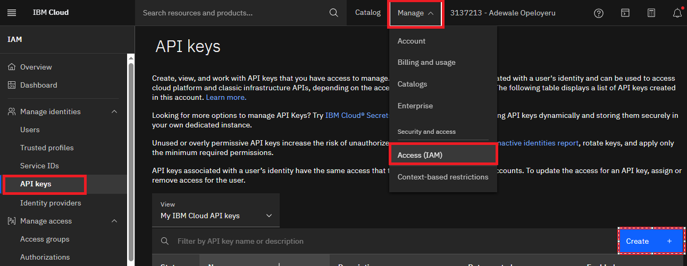

Even though you’ve created the API key, it may not be usable with the pipelines in this project unless you go to `Manage` -> `Access (IAM)` -> `Settings` -> `Authentication` and in the `MFA` panel, make sure `Disable CLI logins with only a password` is unchecked.

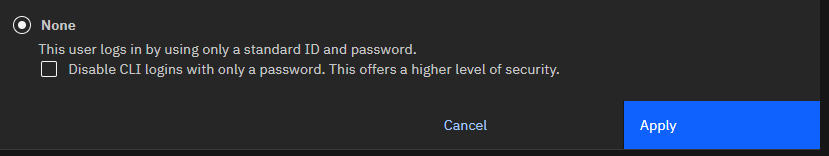

Next, create a free [Hashicorp Cloud Platform](https://app.terraform.io) account. This is the account where Terraform will store and retrieve data required for the infrastructure you are trying to create. You need an organization in your account which will host the workspace where terraform will store the state of your infrastructure and fetch the credential to authenticate with your IBM Cloud account. Create a personal organization named end-to-end-devops.

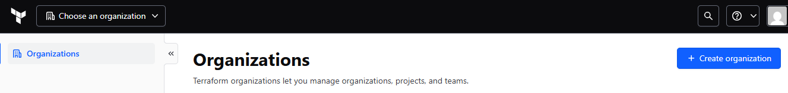

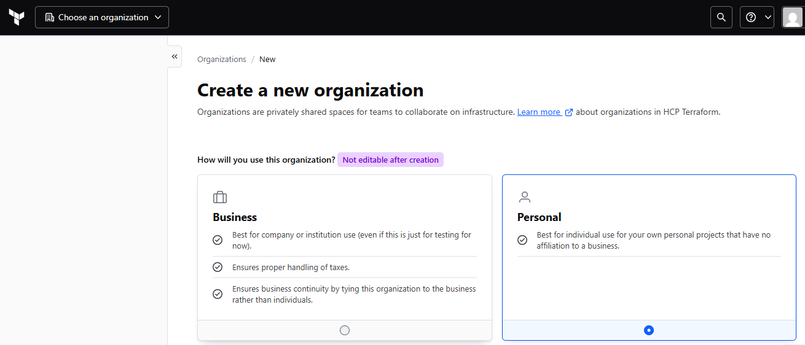

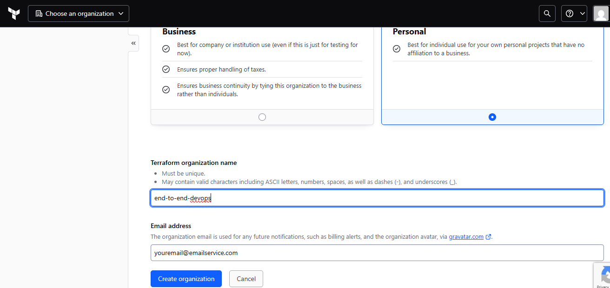

Once the organization is created, select it and create a new workspace called end-to-end-devops-infra.

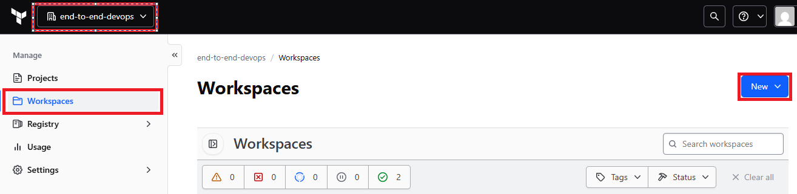

A pop up will ask you to select a project to associate the workspace with. Your organization should come with a default project. Select the default project and click on `Create`.

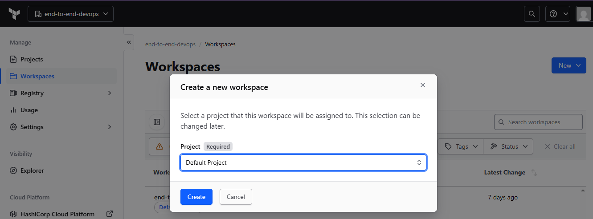

On the next page, select `CLI driven workflow`.

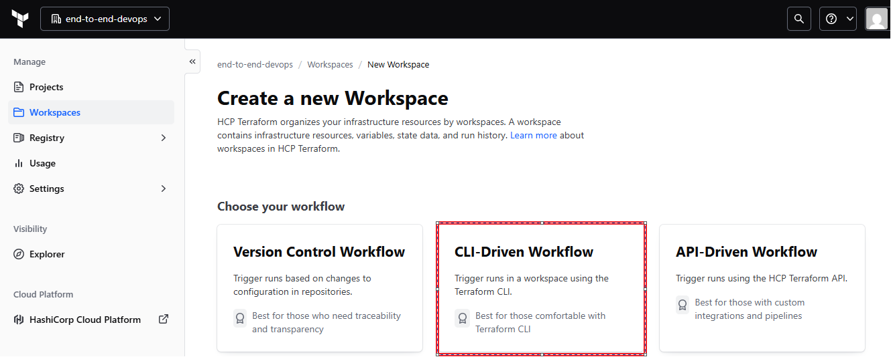

On the next page, enter the name of the workspace and click on `Create`.

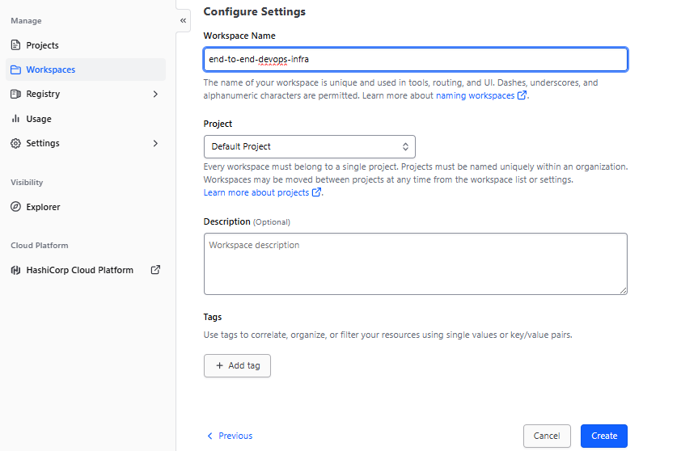

Once the workspace has been created, add a new workspace variable by clicking on the workspace -> `variables` -> `Add variable`.

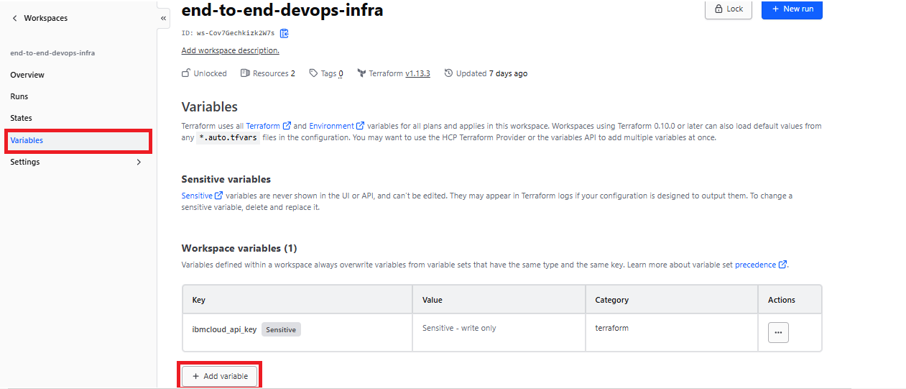

Make sure to select Terraform variable and Sensitive in the pop up. Enter ibmcloud_api_key in the `Key` field and paste the IBMCLOUD_API_KEY that you created earlier in the `Value` field.

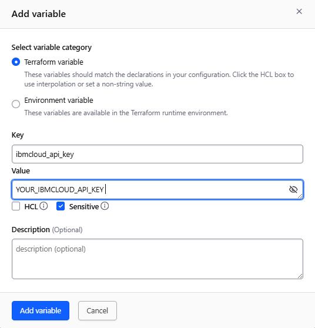

Create another workspace named `end-to-end-devops-monitoring` and add your IBMCLOUD_API_KEY to it following the same steps as above.

Next, create a Terraform API token by selecting `Account settings` -> `Tokens` -> `Create an API token`.

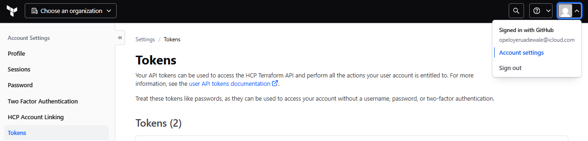

Give it an identifying name like END-TO-END-DEVOPS-TOKEN (the name you give it here does not matter) and set an expiration time.

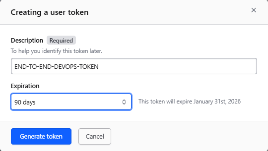

Add the generated Terraform token as a secret to the dev workspace in your Doppler account. Name the secret TERRAFORM_TOKEN.

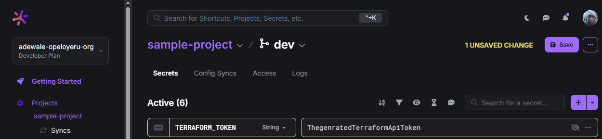

Lastly, create an environment named “dev” in your GitHub repository. This will allow you approve the job that applies the infrastructure changes after reviewing the plan generated by Terraform. Click on `Settings` -> `Environments` -> `New environment`.

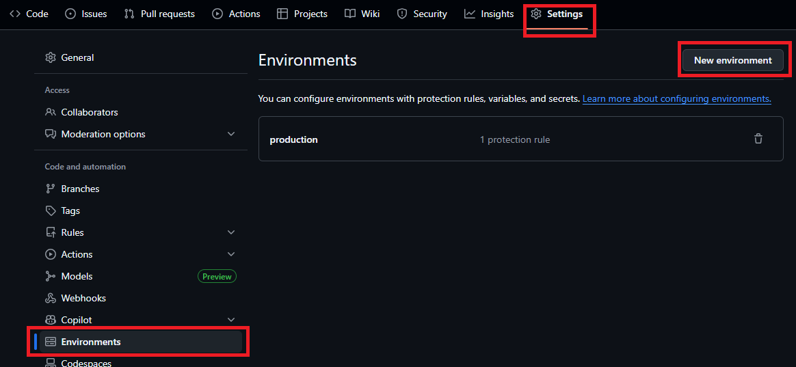

Click on `Configure environment`, check `Required reviewers`, add your GitHub user name, and then click `Save protection rules`.

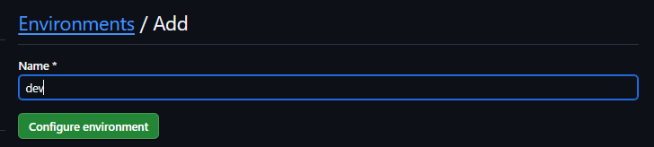

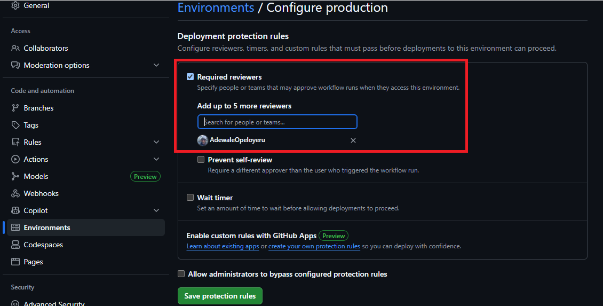

 
 
 
 
 
 
 
 
 
 
 
 
 
 
 
 
 
 
 
 
 
 
 
 
 
 
 
 
 
 
 
 
 
 
 
 
 
 
 
 
 
 
 
 
 
 
 
 
 
 
 
 
 
 
 
 
 
 
 
 

# End-to-End-DevOps
This repo contains code that is used to implement different stages of a DevOps journey, from application code to deployment on a target infrastructure. The code is intended to serve as an adoptable example for new entrants into DevOps and CI/CD. The code is arranged into 4 folders based on functionality and kept in this single repository to make it easy for beginners to follow through and recreate the deployment. In a real DevOps environment, the code will most likely be organized into different repos, following best practices on code separation. At the time of creating this project, maximum effort has been made to ensure that all the resources used in the deployment are free 😊, from cloud infrastructure to CI/CD tools. A more comprehensive article containing every step of the journey can be found here: [link-comming-soon](www.example.com). The article also breaks down key technical concepts in a non technical way to help beginners gain better understanding, so be sure to reference it if you find anything confusing.

## Code Organisation
### .github/workflows
This folder contains all the workflows that is used in this project. Workflows are yaml files containing all the steps(tasks) that we expect a runner to execute when a condition is met. The condition can be when you raise a pull request, push new code or click a manual run button. You can think of a runner as a cloud computer where we run our workflow steps. The files in the the folder are:
- `cicd.yml` 
Contains the CI/CD pipeline that builds and tests the application code, packages the code into a docker image, pushes the docker image to a private registry and deploys the image on IBM cloud
- `create_infra.yml` 
Contains a pipeline with terraform execution steps to create an IBM code engine project in which the application will be deployed
- `create_monitoring.yml` 
Contains a pipeline with terraform execution steps to create a monitoring instance on IBM cloud. The instance is used to collect metrics from the deployed app.
- `destroy_infra.yml` 
Contains terraform execution steps to destroy the IBM code engine project created using `create_infra.yml`. It is considered best practice to destroy cloud infrastructure when it is no longer in use.
- `destroy_monitoring` 
Contains terraform execution steps to destroy the monitoring instance created using `create_monitoring.yml`
### app
This folder contains a sample `hello world` app that is written in java with maven as the build tool. Building a code is the process of converting the code to an executable file that can run on a computer. The folder contains the following files and subfolder:
- `src` 
Sufolder containing the java source and test code for the app.
- `Dockerfile`  
Contains the information required to package the app into  a docker container. Packaging into a container or containerization is the process of packaging an app along with its dependencies so that it can run anywhere without the need to first install dependencies, i.e. we can run our java app without the neeed to first install java.
- `pom.xml` 
Contains a declaration of the dependencies and plugins required to successfully build the code. 
### infra
This folder contains the definition for the deployment infrastructure in terraform. Terraform is a language used for provisioning infrastructure resources through Infrastructure as Code (IaC). The files in the folder are:
- `provider.tf` 
Contains the definition for the cloud provider, IBM cloud in this case.
- `backend.tf` 
Declares the infrastructure workspace in terraform cloud. The workspace helps to hold the statefile which terraform uses to track the state of our resources and also holds the IBM cloud credentials which we cannot hardcode into our terraform files, following security best practices.
- `variables.tf` 
Declares the variables that we use in the rest of the terraform files. The variable values are stored in the infrastructure workspace in terraform cloud. They will be retrieved and inserted by terraform at run time.
- `code_engine.tf` 
Creates an IBM code engine project. IBM code engine is a serverless infrastructure offering from IBM for running containerised applications.
### monitoring
This folder contains the definition for the monitoring instance in terraform. The files in the folder are:
- `provider.tf` 
- `backend.tf` 
Declares the monitoring workspace in terraform cloud.
- `variables.tf` 
Variable values are stored in the monitoring workspace in terraform cloud.
- `monitor.tf` 
Creates a monitoring instance using an official module provided by IBM cloud. Modules are predefined terraform templates that help organise and standardise infrastructure as code.
## How to Create Your Own Deployment Using the Code in This Repo
There is an article that provides step by step guidance here: [link-comming-soon](www.example.com). If you are completely new to the described applications and concepts, you should follow the article for a more comprehensive guidance.
### Prerequisites
#### Setup your own Repository
- Fork this repository.
- Create a new environment called `dev` and add yourself as a reviewer.
#### Setup Doppler
Doppler is an application used for secret management.
- Create a free doppler account to store the secrets used in the GitHub actions workflows: https://www.doppler.com/.
- Create a service token that will be used to fetch the stored tokens.
- Add the service token as a secret named `DOPPLER_TOKEN` in actions variables in your own fork of the repository.
- Create a new project in doppler and name it `sample-project`. This should create three environments `dev`, `stage` and `prod`. You will store your secrets in the `dev` environment.
#### Setup IBM Cloud
IBM cloud is used to host the infrastructure for deployment and monitoring.
- Create a free IBM Cloud account: https://cloud.ibm.com/.
- Create an IBM Cloud API Key.
#### Setup Terraform Cloud
Terraform is used to provision resources on IBM Cloud using IaC. Terraform cloud is used as a remote backend to store state files and variables.
- Create a free Terraform cloud account: https://app.terraform.io/.
- Create an organization, `end-to-end-devops`
- Create two workspaces in the organization, `end-to-end-devops-infra` and `end-to-end-devops-monitoring`.
- In each workspace, create a terraform variable called `ibmcloud_api_key` and set the value to the IBM Cloud API Key you created in the above step.
- Create a user API token and add it to the `dev` environment in the doppler `sample-project`as `TERRAFORM_TOKEN`.
#### Setup SonarCloud
SonarQube is a code scanning tool for scanning application code for quality issues and security hotspots.
- Create a free SonarCloud account: https://sonarcloud.io/.
- Generate an access token and add it to the doppler `sample-project` as `SONARQUBE_TOKEN`.
#### Setup Snyk
Snyk is a code scanning tool used to scan for vulnerabilities in external dependencies and plugins used in an application code.
- Create a free Snyk account: https://app.snyk.io/.
- Generate an auth token and add it to the doppler `sample-project` as `SNYK_TOKEN`.
#### Setup Cloudsmith
Cloudsmith is a package repository for storing artefacts such as executable binaries and docker images.
- Create a free Cloudsmith account: https://app.cloudsmith.com/.
- Create a personal API key and add it to the doppler `sample-project` as `CLOUDSMITH_TOKEN`
- Create a new workspace named `sample-workspace`.
- Create a new repository named `sample-docker-repo`.
### Create Deployment infra structure
Manually trigger the `create_infra.yml` GitHub workflow to create an IBM Cloud code engine project. The workflow has a `plan` job and an `apply` job. Approve the apply job after reviewing the planned changes.
### Test, Biuld and Deploy
The `cicd.yml` workflow contains steps to test, build the app and deploy to the code engine project created in the step above. The jobs in the workflow are triggered when changes are made to the application code and pushed upstream, when a pull request is raised or when the workflow is triggered manually. There are three jobs; `build-and-test`(Continuous Integration), `containerize-and-deliver`(Continuous Delivery) and `deploy`(Continuous Deployment). The `build-and-test` job tests and builds the application code to confirm changes made to it did not break it. This job runs on all branches in the repository.
The `containerize-and-deliver` job packages the app into a docker container and pushes the container to an upstream docker repository. The `deploy` job deploys the application to the code engine project created earlier. Note that both the `containerize-and-deliver` and the `deploy` job are only run when there is a push to the main branch or when the workflow is triggered from the main branch. After the deploy job is run, the job run will output a URL that you can visit and see the deployed app.
### Monitor the deployed application
Manually trigger the `create_monitoring.yml` GitHub workflow to create an IBM Cloud monitoring instance. The workflow only creates the instance but doesn't enable Platform Metrics. IBM cloud does not support enabling Platform Metrics via terraform or any other API call at the time this project was created. After creating the instance, login to IBM cloud, under observability -> monitoring -> monitoring instances, you will see an instance named `cloud-monitoring-*`. Enable platform metrics and set location to the location of the app. Once setup is complete, wait for some minutes and you should be able to see information about the deployed app in the monitoring instance dashboard.
## House Cleaning.
One of the best practices of DevOps is to clean up after resources are no longer needed. You can experiment with changing the app code or even play around with the ci/cd pipeline based on your level of experience, but once you are done with expierimenting, destroy the created cloud resources by doing the following:
- Run `destroy_infra.yml` to destroy the code engine project
- Run `destroy_monitoring.yml` to destroy the monitoring instance.

> [!CAUTION]
> _IBM Cloud has a concept called reclaimations. This means that destroyed resources are kept in a state where they can be reclaimed for seven days._
> _During the reclaimation period, you cannot create resources with the same name as resources in the reclaimation state._
> _To create resources with the same name, you need to login to IBM Cloud, go to the section where the resources reside and delete reclaimations._
> _In other words, if you run and approve `destroy_infra.yml` (or `destroy_monitoring.yml`), running `create_infra.yml` (or `create_monitoring.yml`) will fail unless you delete reclaimations or wait for seven days._

