# A BEGINER’S PRACTICAL GUIDE TO DEVOPS
###### _LEARN DEVOPS BY DEPLOYING A SAMPLE APPLICATION_
For a new or aspiring joiner in DevOps, the sheer breadth of the technology stack can feel overwhelming and it may be difficult to connect everything to together to see the end picture. The best way to learn DevOps isn’t by memorising tools or watching endless tutorials. It’s by building something real. So instead of giving you another abstract explanation, this tutorial drops you straight into the real thing with a DevOps project that you can replicate at zero cost. You’ll build, deploy and monitor an actual application, just like a DevOps engineer would on the job. This guide walks you through the entire process step by step, with complex concepts broken down clearly and best practices highlighted along the way.

> [!NOTE]
> This tutorial is a deep dive for beginners. Don't rush! I recommend breaking it into multiple sessions to ensure the concepts really stick.

## OVERVIEW OF PROJECT
The project consists of the following components:
-   A simple ‘welcome to devops’ application written in java,
-   A pipeline to create infrastructure through Infrastructure as code that the application will be deployed on,
-   A CI/CD pipeline to build and test the application, package it into a Docker container and deploy it to a target infrastructure,
-	A pipeline to create infrastructure to monitor the deployed application, and 
-	Pipelines to destroy created infrastructure once you have completed the project and are no longer actively working on it.

## DEVOPS COMPONENTS YOU WILL LEARN
The project in this repository touches on core components like:
-	Source code version control,
-	Secret management,
-	Continuous integration and Continuous delivery/deployment (CI/CD),
-	Infrastructure as code,
-	Dependencies scanning,
-	Vulnerabilities scanning,
-	Application versioning
-	Artifacts management,
-	Containerization and Container Orchestration (Abstracted Kubernetes for simplicity),
-	Monitoring.

> [!WARNING]
> In this tutorial, I’ve stripped down the jargon to give you a clear mental model of DevOps.<br>
> The goal is to help you understand the "why" and "what" of each component and see examples of tools in action.<br>
> While this gets you started quickly, it does not replace the need for deep technical mastery of tools and components as you grow.

Now Let’s dive into deploying your own version of the project. I enjoyed creating this project. I hope you enjoy replicating it and even go further to creating your own unique projects.

## DEPLOYING YOUR OWN VERSION OF THE PROJECT
### Fork the Repository
The first thing you need to do is to fork the project.


If you are unfamiliar with GitHub, A simple explanation is that it is a solution for storing your code plus associated files and changes you make to them over time. It is based on Git, a version control system that tracks changes in any directory where it is initialized. To fork this repository, you must first create your own [GitHub account](https://github.com/signup).

When you fork a repository, GitHub copies the content of that repository to your own GitHub account. The content of your forked repository should be an exact copy of this repository. Your repository should contain the app code, infrastructure code, cicd pipelines and other files.

In practice, keeping your application code and infrastructure configuration in the same repository is considered poor practice. I kept them in the same repository to make this project easy for you to follow. The app folder contains the application code and container image definition. The infra folder contains the deployment infrastructure code and the monitoring folder contains the monitoring infrastructure code. It is a best practice to separate monitoring infrastructure from the deployment infrastructure. This helps facilitate detection of issues independently of the systems or applications being monitored, reduces risk and improves performance.

### Setup Secrets Management
Secrets management is an important concept in DevOps that looks at the secure handling of credentials used in pipelines. I collected some data driven reports to show you the importance of proper credential handling and give you an idea of how devastating badly handled credentials can be. A 2025 data analysis by [GitGuardian](https://www.gitguardian.com/state-of-secrets-sprawl-report-2025) revealed that about 23.8 million new secrets were detected in public GitHub commits in 2024 (+25% from the previous year). Leaked secrets, when they get into the hands of bad actors can lead to severe consequences like data breach. [A study at IBM](https://www.ibm.com/reports/data-breach) currently estimates the global average cost of data breach to be $4.4M.

The easiest method of secrets handling is using GitHub Secrets which hosts secrets within a repository. In practice, organizations find this insufficient for many good reasons. To give you one very simplified example, imagine a hacker gets into your organization’s GitHub repo, they don’t just steal your code; they find the keys to your actual house. With those stored secrets, they can log into your infrastructure, delete your databases, or steal customer data, turning a 'code leak' into a total business shutdown.

To ensure tight security in adherence to best practices, organizations use a self-hosted secrets management platform. To help you understand what this feels like in real practice, the pipelines in this project use secrets stored in a free vendor-hosted secret management account from Doppler. The downside to using a free account is that your secrets are stored with the vendor and fetching those secrets requires a token that we need to store in GitHub Secrets. Nevertheless, this implementation gives you a feel of how secrets are managed in DevOps pipelines.

Create a free account on https://www.doppler.com. Once in your account, go to projects and create a new project called sample-project.


The project should contain dev, stage and prod environments by default. You will store your secrets in the dev environment. Go to the dev environment -> `access` -> `generate`, to generate a service token.


Add the service token as a secret named `DOPPLER_TOKEN` in actions variables in your own fork of this repository. Click on `Settings` -> `Secrets and Variables` -> `Actions` -> `New repository secret`.


### Create Deployment Infrastructure
Think of the deployment infrastructure as the computer on which your application will run. The computer will be hosted in the cloud. Cloud Computing is the process of using computers provided by Cloud Providers to run applications and services in exchange for a fee. Businesses and engineers don’t have to host physical computers, servers or data centres. One obvious advantage of this is that you can choose to pay for computing resources only when you need them and don’t need to worry about the purchase or maintenance of physical computing resources. According to research by [Gitnux](https://gitnux.org/cloud-industry-statistics/), over 90% of enterprises are using cloud services in some capacity with nearly 60% of companies seeing cost savings as the primary benefit of running applications in the cloud.

The deployment infrastructure in this project is defined as code using Terraform. Terraform is an Infrastructure as Code (IaC) language, developed by Hashicorp and is widely used in the DevOps practice. One big advantage of using infrastructure as code is that it streamlines, standardizes and automates infrastructure creation. Imagine you want to create hundreds of servers in the cloud, doing this on the cloud provider’s UI will be error prone and grossly inefficient. IaC tools like Terraform can help you automate and streamline such tasks. If you are interested in learning more about how industries adopt IaC, you can look at the report by [Grand View Research](https://www.grandviewresearch.com/industry-analysis/infrastructure-as-code-market-report).

To align the infrastructure creation with DevOps best practices, a pipeline named create_infra.yml has been written and stored in the .github/workflows folder. To be able to run the pipeline to create the infrastructure, there are some prerequisites that you must complete.

#### Prerequisites
First, create a free IBM Cloud account, https://cloud.ibm.com. Then, create an API key named IBMCLOUD_API_KEY by clicking `Manage` -> `Access (IAM)` -> `API Keys` -> `Create`. Make sure you copy the key somewhere safe as you will need to add it to your Hashicorp account which you will create next.


Even though you’ve created the API key, it may not be usable with the pipelines in this project unless you go to `Manage` -> `Access (IAM)` -> `Settings` -> `Authentication` and in the `MFA` panel, make sure `Disable CLI logins with only a password` is unchecked.


Next, create a free [Hashicorp Cloud Platform](https://app.terraform.io) account. This is the account where Terraform will store and retrieve data required for the infrastructure you are trying to create. You need an organization in your account which will host the workspace where terraform will store the state of your infrastructure and fetch the credential to authenticate with your IBM Cloud account. Create a personal organization named `end-to-end-devops`.


Once the organization is created, select it and create a new workspace called `end-to-end-devops-infra`.


A pop up will ask you to select a project to associate the workspace with. Your organization should come with a default project. Select the default project and click on `Create`.


On the next page, select `CLI driven workflow`.


On the next page, enter the name of the workspace and click on `Create`.


Once the workspace has been created, add a new workspace variable by clicking on the workspace -> `variables` -> `Add variable`.


Make sure to select Terraform variable and Sensitive in the pop up. Enter `ibmcloud_api_key` in the `Key` field and paste the IBMCLOUD_API_KEY that you created earlier in the `Value` field.


Create another workspace named `end-to-end-devops-monitoring` and add your IBMCLOUD_API_KEY to it following the same steps as above.

Next, create a Terraform API token by selecting `Account settings` -> `Tokens` -> `Create an API token`.


Give it an identifying name like END-TO-END-DEVOPS-TOKEN (the name you give it here does not matter) and set an expiration time.


Add the generated Terraform token as a secret to the dev workspace in your Doppler account. Name the secret `TERRAFORM_TOKEN`.


Lastly, create an environment named `dev` in your GitHub repository. This will allow you approve the job that applies the infrastructure changes after reviewing the plan generated by Terraform. Click on `Settings` -> `Environments` -> `New environment`.


Click on `Configure environment`, check `Required reviewers`, add your GitHub user name, and then click `Save protection rules`.


#### Explanation of the Infrastructure Definition in Terraform
The infrastructure code is stored in the infra folder and is defined by four Terraform files;  provider.tf, backend.tf, code_engine.tf and variables.tf.

##### provider.tf
```terraform
terraform {
  required_providers {
    ibm = {
      source  = "IBM-Cloud/ibm"
      version = ">= 1.12.0"
    }
  }
}

# Configure the IBM Provider
provider "ibm" {
  ibmcloud_api_key = var.ibmcloud_api_key
  region           = "eu-gb" # you can change this to your own region
}

```
These lines of code tell Terraform who the cloud provider is (IBM Cloud), the name of the IBM Cloud API KEY which it needs to access the IBM Cloud account to provision resources, and the cloud region where the infrastructure should be created. Most cloud computing companies provide a free to use plugin (known as providers) for Terraform to easily integrate with their platform and provision resources when authorized. You can read more about the IBM Cloud provider plugin here: https://registry.terraform.io/providers/IBM-Cloud/ibm/latest/docs.

##### backend.tf
```terraform
terraform {
  backend "remote" {
    hostname     = "app.terraform.io"
    organization = "end-to-end-devops"

    workspaces {
      name = "end-to-end-devops-infra"
    }
  }
}

```

These lines tell Terraform that we will be storing information about the state of the infrastructure in the Terraform Cloud account that was created earlier, and provides the name of the organization and the name of the workspace. Terraform will also check the workspace for values of any variable that was declared and used in the files if they are not supplied at run time.

##### variables.tf
```terraform
# Declare a variable for the api key
variable "ibmcloud_api_key" {
  description = "IBM Cloud API key for authentication"
  type        = string
  sensitive   = true
}

```
These lines tell Terraform that a variable named "ibmcloud_api_key" would be used, it is a string, and contains sensitive information. It is a Terraform best practice to define all variables used in an infrastructure definition in a separate file named variables.tf.

##### code_engine.tf
```terraform
data "ibm_resource_group" "group" {
  name = "Default"
}

resource "ibm_code_engine_project" "devops_ce_project" {
  name              = "end_to_end_devops"
  resource_group_id = data.ibm_resource_group.group.id
}

```

These lines define a code engine project which is the infrastructure that is used to run the application on IBM Cloud. In a real business setup, applications are deployed to a Kubernetes cluster on a cloud platform. Since the goal of this project is to provide an easy to understand example deployment while ensuring that it can be done using free resources, we will be using IBM Cloud code engine for the deployment. IBM Cloud Code Engine is built on Kubernetes, but it abstracts away the complexity so you don’t need to manage Kubernetes clusters directly and has a generous amount of free tier.

When you created your IBM Cloud account earlier, a resource group named “Default” was created for you. Resource groups are used to group your cloud resources, making it easier to assign access, monitor usage, and maintain governance. Lines 1-3 fetch information about the “Default” resource group for the IBM Cloud account. Lines 5-8 create the code engine project with name “end_to_end_devops” and attach the id of the default resource group fetched as part of the data in lines 1-3 to it.

#### Explanation of the Pipeline
```yml
name: Create Required Infrastructure 

on:
  workflow_dispatch:

jobs:
  plan:
    name: plan and review
    runs-on: ubuntu-latest
    steps:
      - name: checkout code
        uses: actions/checkout@v3

      - name: run checkov scan
        uses: bridgecrewio/checkov-action@v12
        with:
          output_format: cli
          directory: ./infra

      - name: fetch tokens
        id: doppler
        uses: dopplerhq/secrets-fetch-action@558a97f7f29b80c369cc89e9ecb697c7941dba87
        with:
          doppler-token: ${{ secrets.DOPPLER_TOKEN }}

      - name: setup terraform
        uses: hashicorp/setup-terraform@c529327889820530c60b4ce5bbc8d6099e166666
        with:
          terraform_version: 1.13.3

      - name: set terraform cloud token
        run: |
          echo "TF_TOKEN_app_terraform_io=${{ steps.doppler.outputs.TERRAFORM_TOKEN }}" >> $GITHUB_ENV

      - name: terraform init
        run: |
          cd infra
          terraform init

      - name: terraform plan
        run: |
          cd infra
          terraform plan

  apply:
    name: apply changes
    runs-on: ubuntu-latest
    needs: plan
    environment:
      name: dev
    steps:
      - name: checkout code
        uses: actions/checkout@v3

      - name: fetch tokens
        id: doppler
        uses: dopplerhq/secrets-fetch-action@558a97f7f29b80c369cc89e9ecb697c7941dba87
        with:
          doppler-token: ${{ secrets.DOPPLER_TOKEN }}

      - name: setup terraform
        uses: hashicorp/setup-terraform@c529327889820530c60b4ce5bbc8d6099e166666
        with:
          terraform_version: 1.13.3

      - name: set terraform cloud token
        run: |
          echo "TF_TOKEN_app_terraform_io=${{ steps.doppler.outputs.TERRAFORM_TOKEN }}" >> $GITHUB_ENV
    
      - name: terraform init
        run: |
          cd infra
          terraform init

      - name: terraform apply
        run: |
          cd infra
          terraform apply -auto-approve

```
The file containing the YAML code that defines a GitHub Actions pipeline is called a workflow. The `create_infra.yml` workflow consists of two jobs; a plan job and an apply job. The apply job needs the plan job to run first and requires approval before running. The workflow has a workflow_dispatch trigger, meaning you run it using a `Run` button on the UI, and uses an Ubuntu virtual machine as the runner. The jobs consist of the following steps:
- **checkout code** – Downloads a copy of the repository to the virtual machine. Note that this is achieved through an already existing action from GitHub, `actions/checkout` and pinned to version 3. Reusing existing actions help speed up tasks and avoid reinventing the wheel. This is achieved by using the `uses` keyword in a GitHub Actions workflow.
- **run checkov scan** – Scans the terraform configuration for vulnerabilities. Checkov is a policy as code tool specifically designed for this purpose.
- **fetch tokens** – Connects to your Doppler account and gets secrets defined in the dev workspace. Note that we adopted the official action by doppler but pinned it to a commit SHA. This is the most secure way to adopt existing actions because commit SHAs are unique per code you push to GitHub. Adopting the action this way means you are certain of the exact code that your action will run.
- **setup terraform** – Downloads and installs Terraform CLI on the runner.
- **set terraform cloud token** – Copies the Terraform token returned in the fetch tokens step to an environment variable used by terraform for authentication.
- **terraform init** – Changes directory to the infra folder and initializes Terraform. When a `terraform init` command is run, Terraform downloads API plugins from the cloud provider (which is IBM Cloud for this project) and also initializes the backend (which is Terraform Cloud for this project).
- **terraform plan** – Changes directory to the infra folder and provides a summary of the infrastructure that will be created based on the definition in code_engine.tf. This step is only executed in the plan job. A typical plan looks like below.
- **terraform apply** – Changes directory to the infra folder and creates the infrastructure based on the definition in code_engine.tf. This step is only executed in the apply job.
If you wonder why both jobs contain the same first five steps, it is because each GitHub Actions job run on a different virtual machine and steps in one job are not directly visible to another job. Information can still be passed between jobs, but that is out of the scope of this article.

#### Run the Pipeline
You are now ready to create your first infrastructure by running the infrastructure creation pipeline. Go to `Actions` -> `Create Required Infrastructure` -> `Run Workflow` -> `Run Workflow`.

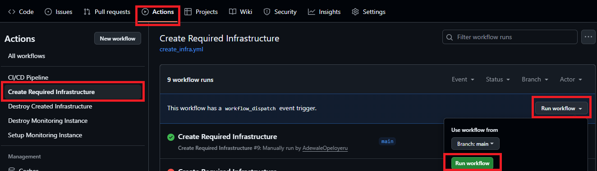

Refresh the page to see the triggered workflow run.

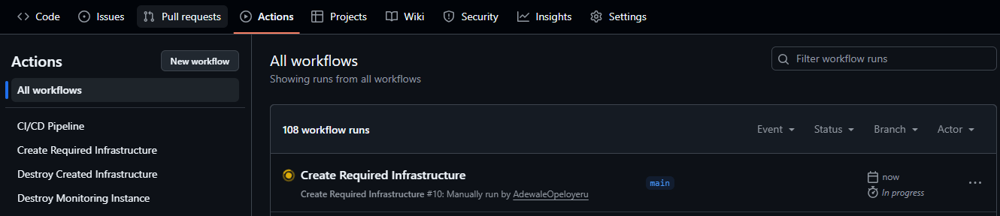

Click on the run and you will see the jobs running. The workflow consists of two jobs. The First job plans the changes, the second job requests your approval and then applies the changes once you have approved. After the first job has finished running, approve the second job by clicking `Review deployments`

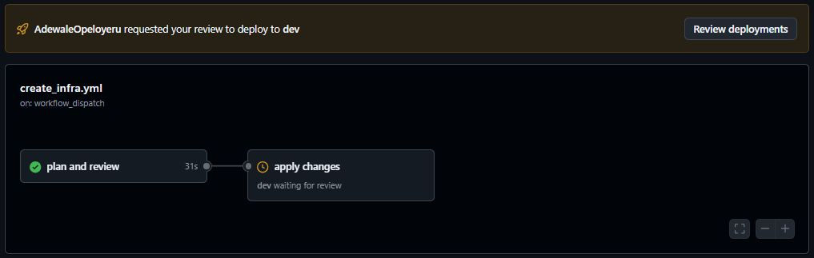

Select the `dev` check box and approve the deployment by clicking `Approve and deploy`.

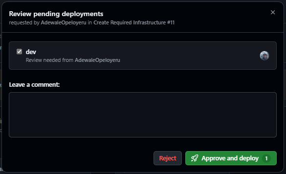

When the job finishes running, go to IBM Cloud, click on `Containers` -> `Serverless Projects`.

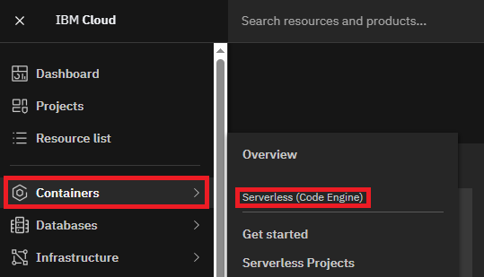

You should see a code engine project named `end_to_end_devops`.

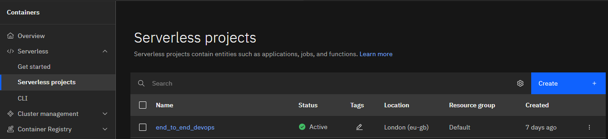

> [!Tip]
> If you run into errors while running the GitHub Actions pipeline, confirm you did not miss any of the steps above.
> Next, leverage the power of Artificial Intelligence by asking an AI agent like co-pilot to explain the error to you.

### Deploy the Application
The repository contains a simple java application, something similar to the classic `hello world!`. The application is stored in the `app` folder, along with its dependencies definition and a Docker image definition. The application and test code is stored in the `src` subfolder. To keep things simple, I will not go into granular details of the application source code.
The Dockerfile helps to containerize the application. This means that the application contains everything it needs to run, i.e. to run the application, you do not need to first install a java runtime engine. This helps ensure the application can run anywhere and eliminates a classic problem: `It works on my machine`.

The workflow to deploy the app is named `cicd.yml`. It consists of three jobs; Continuous Integration, Continuous Delivery and Continuous Deployment. The workflow is triggered when changes to the code in the app folder is pushed to the project repository on GitHub, a Pull Request is created, or when manually dispatched on the UI.

#### Continuous Integration
Continuous Integration is a practice where developers frequently merge code changes into a shared repository, triggering automated builds and tests to detect integration issues early and ensure software quality. To successfully run the continuous integration job, you need to set up some prerequisites.
First, create a free account on [SonarCloud](https://sonarcloud.io/).  SonarQube is a code analysis tool used in this project for Static Application Security Testing (SAST), i.e. used to analyze code before the code is run. It helps to detect code quality issues, vulnerabilities and security hotspots, leading to cleaner and safer software.
Here is a sample result of SonarQube scan of the App in this project:

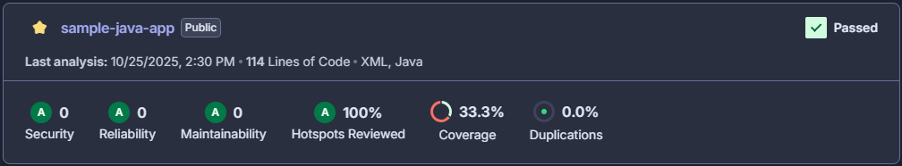

The scan will fail if there is a serious problem with security, reliability, maintainability and hotspots. The scan can also be configured to fail based on code coverage or duplications.
After creating your account, create a new organization. The easiest way to do this is to connect your GitHub account. Name the organization `sample-organization` and name the key `sampleorgkey`.


Import the end-to-end-devops project from GitHub to the Sonar Cloud organization.

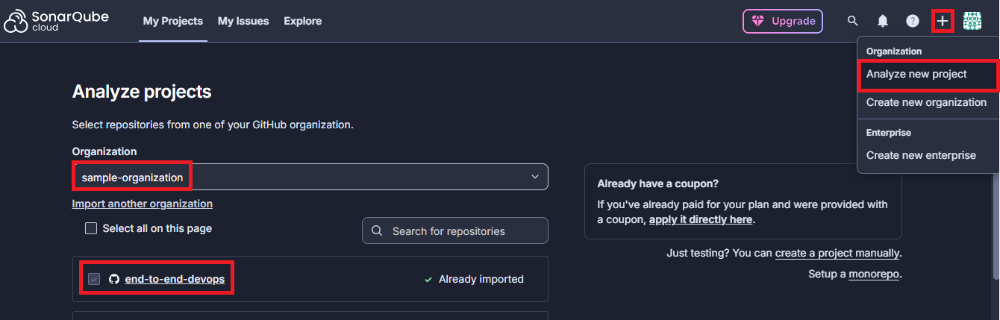

Update the project key to end-to-end-devops by selecting the project -> `Administration` -> `Update Key`.

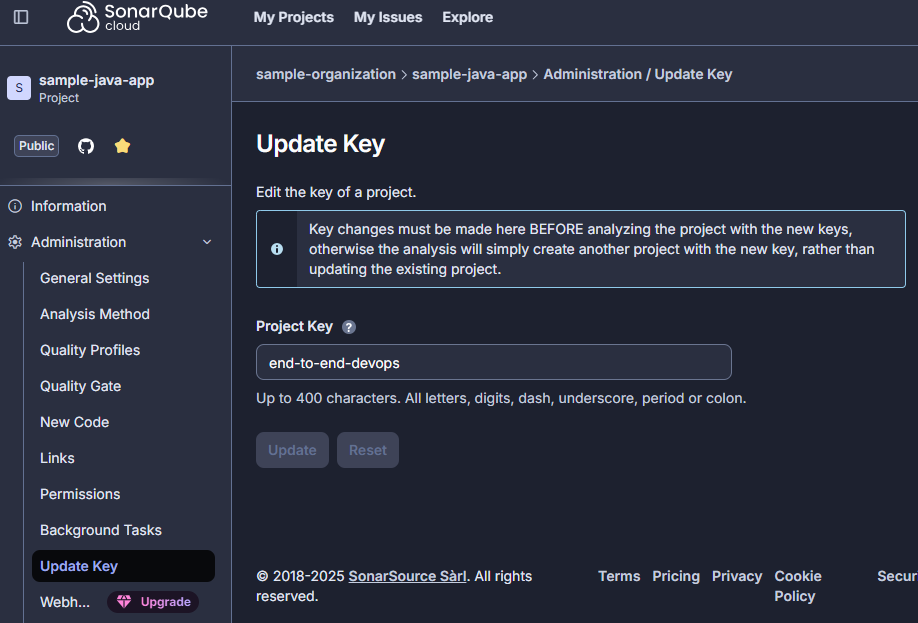

Generate an access token by going to `My Account` -> `Security`. Copy the token and add it to the Doppler dev workspace created in earlier steps as `SONARQUBE_TOKEN`.

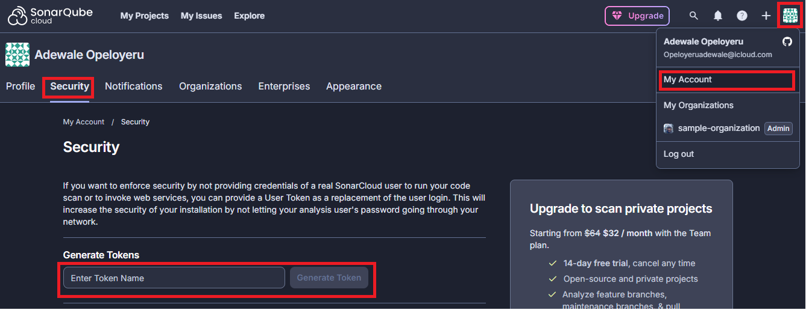

Next, create a free account on [Snyk](https://app.snyk.io/) using your Github account. Snyk is a tool that helps identify vulnerabilities in code, open source dependencies, containers, and infrastructure as code. In this project, it is used for Software Composition Analysis (SCA), i.e. to scan for vulnerabilities in the external dependencies used in this project. Using external dependencies halp speed up and simplify software development by reusing code shared by others.

Here is a sample result of Snyk scan of the dependencies in this project:

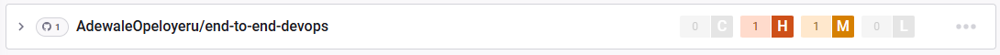

The Snyk scan will fail based on the severity of vulnerabilities found in the external dependencies and tell you if there are newer versions in which the vulnerabilities were fixed. You can also tell snyk the severity threshold at which scans should fail.

After creating your account, Snyk will generate a token for you which you can copy and use to run Snyk scans using Snyk CLI. Click <YOUR_ACCOUNT> -> `Account settings` -> `Auth Token` -> `click to show`

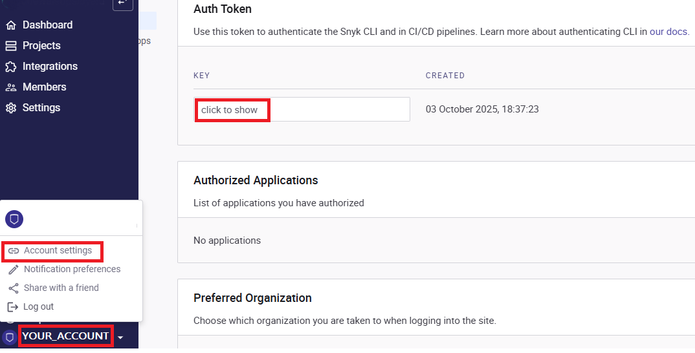

Add the token to your Doppler dev workspace as SNYK_TOKEN.
Next, create a new organization and give it any name. Add your copy of this project Github repository to your Snyk organization by clicking `Projects` -> `Add Projects` -> `GitHub`.


Select the end-to-end-devops repository and wait for the project to finish importing.

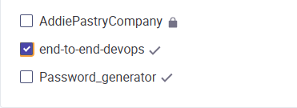

#####  Explanation of the Pipeline
```yaml
name: CI/CD Pipeline

on:
  push:
    branches:
      - '**'
    paths:
      - 'app/**'
      - '.github/workflows/cicd.yml'
  pull_request:
    branches:
      - '**'
    paths:
      - 'app/**'
      - '.github/workflows/cicd.yml'
  workflow_dispatch:

permissions:
  security-events: write

jobs:
  build-and-test:
    name: Continous Integration
    runs-on: ubuntu-latest
    steps:
      - name: checkout code
        uses: actions/checkout@v4

      - name: fetch tokens
        id: doppler
        uses: dopplerhq/secrets-fetch-action@558a97f7f29b80c369cc89e9ecb697c7941dba87
        with:
          doppler-token: ${{ secrets.DOPPLER_TOKEN }}

      - name: setup java and maven
        uses: actions/setup-java@v3
        with:
          distribution: 'temurin'
          java-version: '21'
          cache: 'maven'

      - name: run tests
        run: |
          cd app
          mvn clean test

      - name: build and scan with sonarqube
        env:
          SONAR_TOKEN: ${{ steps.doppler.outputs.SONARQUBE_TOKEN }}
        run: |
          cd app
          mvn clean package org.sonarsource.scanner.maven:sonar-maven-plugin:sonar \
          -Dsonar.java.jdkHome=${{ env.JAVA_HOME }} \
          -Dsonar.host.url=https://sonarcloud.io \
          -Dsonar.organization=sampleorgkey \
          -Dsonar.projectKey=end-to-end-devops

      - name: setup node.js
        uses: actions/setup-node@v4
        with:
          node-version: '20'

      - name: install snyk cli
        run: npm install -g snyk

      - name: snyk scan
        env:
          SNYK_TOKEN: ${{ steps.doppler.outputs.SNYK_TOKEN }}
        run: snyk test --all-projects --severity-threshold=high

      - name: initialize codeql
        uses: github/codeql-action/init@v4
        with:
          languages: java
          build-mode: autobuild

      - name: perform codeql analysis
        uses: github/codeql-action/analyze@v4

      - name: test build docker image
        run: |
          cd app
          docker build -t sample-docker-image .
      
      - name: scan docker image with trivy
        uses: aquasecurity/trivy-action@0.33.1
        with:
          image-ref: sample-docker-image
          format: table
          exit-code: '1'
          severity: HIGH,CRITICAL
```
The GitHub actions job for continuous integration is included in the `cicd.yml` file. The continuous integration job runs when code is pushed to any branch, a pull request is raised or it is dispatched manually on any branch. It consists of the following steps:
- **checkout code** – Same as explained earlier.
- **fetch tokens** – Same as explained earlier.
- **setup java and maven** – Installs java and maven on the runner.
- **run tests** – Runs tests for the code in the app folder.
- **build and scan with sonarqube** – Builds the code and scans with SonarQube. The app in the project has test coverage of only 33.3%. This way, the SonarQube Quality Gate for the project will fail. This helps you get a feel of how failures in SonarQube looks. The quality gate failure does not fail the pipeline. Try to write test cases to improve the coverage. Remember you can leverage AI to get this done. It is a very simple code and so a free model can help you with the tests. You can also experiment with the settings to make the pipeline fail when your preferred quality gate is not met.
- **setup node.js** – Installs node.js on the runner. This is required to set up Snyk CLI.
- **install snyk cli** – Installs Snyk CLI. This is required to perform Synk Scan.
- **snyk scan** – Scans the external dependencies and fails when there is a high severity vulnerability. This behaviour is customizable. You are welcome to explore.
- **initialize codeql** – Initializes CodeQL, a tool for code analysis from GitHub for advanced code .vulnerability detection.
- **perform codeql analysis** – Performs the CodeQL analysis.
- **test build docker image** – Containerizes the built app in the “build and scan with sonarqube step” into a docker image to validate the definition in the Dockerfile.
- **scan docker image with trivy** – Scans the image for vulnerabilities. Trivy is a tool for scanning IaC, kubernetes and docker images for vulnerabilities, exposed secrets and misconfiguration.

#### Continuous Delivery
Continuous Delivery is a practice where code changes are automatically built and packaged so that they are always in a deployable state, enabling fast and reliable releases to production at any time. Before you can run the continuous delivery job in this project, there is a prerequisite you need to complete.

Create a free [Cloudsmith account](https://app.cloudsmith.com/). Cloudsmith is an artifact storage solution that helps to securely store and distribute software packages and container images. The docker image created by the Continuous Delivery job will be pushed to your Cloudsmith account. If prompted during the account creation, set your username (user slug/identifier) as `my-cloudsmith-user` and create a new workspace named `sample-workspace`. If you did not get an option to set your username or create a workspace during the account creation process, go to `My Account` -> `Profile` -> `Rename user slug/identifier`, to set the username. Go to `My Account` -> `Workspaces` -> `Create workspace`, to create the workspace.

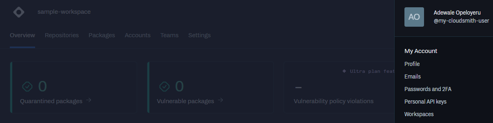

In your workspace, create a new repository by clicking `New repository`. Name the repository `sample-docker-repository`.
Create and copy your Personal API Key by going to `My Account` -> `Personal API Keys`. Add the token to your Doppler dev workspace as `CLOUDSMITH_TOKEN`. At this point, your Doppler dev workspace should look like below.

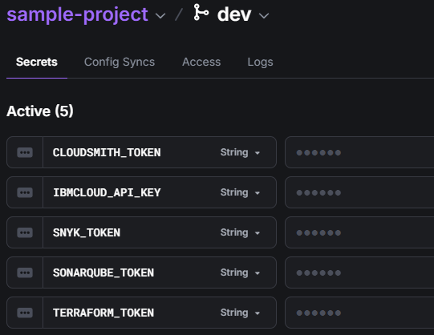

##### Explanation of the Pipeline
```yaml
  containerize-and-deliver:
    name: Continuous Delivery
    runs-on: ubuntu-latest
    needs: build-and-test
    if:   ${{ (github.event_name == 'workflow_dispatch' && github.ref == 'refs/heads/main') || (github.event_name == 'push' && github.ref == 'refs/heads/main') }}
    outputs:
      semver: ${{ steps.generate_semver.outputs.fullSemVer }}
    steps:
      - name: checkout code
        uses: actions/checkout@v4
        with:
          fetch-depth: 0

      - name: fetch tokens
        id: doppler
        uses: dopplerhq/secrets-fetch-action@558a97f7f29b80c369cc89e9ecb697c7941dba87
        with:
          doppler-token: ${{ secrets.DOPPLER_TOKEN }}
      
      - name: setup java
        uses: actions/setup-java@v3
        with:
          distribution: 'temurin'
          java-version: '21'
          cache: 'maven'
      
      - name: build with maven
        run: |
          cd app
          mvn clean package -DskipTests

      - name: install gitversion
        uses: gittools/actions/gitversion/setup@v4.2.0
        with:
          versionSpec: '6.4.x'

      - name: generate semver
        id: generate_semver
        uses: gittools/actions/gitversion/execute@v4.2.0

      - name: show semver
        run: |
          echo "FullSemVer: ${{ steps.generate_semver.outputs.fullSemVer }}"

      - name: build docker image
        run: |
          cd app
          docker build -t sample-docker-image .

      - name: tag and push to cloudsmith
        env:
          USERNAME: my-cloudsmith-user
          PASSWORD: ${{ steps.doppler.outputs.CLOUDSMITH_TOKEN }}
        run: |
          echo ${{ env.PASSWORD }} | docker login -u ${{ env.USERNAME }} --password-stdin  docker.cloudsmith.io
          docker tag sample-docker-image docker.cloudsmith.io/sample-workspace/sample-docker-repo/sample-docker-image:${{ steps.generate_semver.outputs.fullSemVer }}
          docker push docker.cloudsmith.io/sample-workspace/sample-docker-repo/sample-docker-image:${{ steps.generate_semver.outputs.fullSemVer }}
```

The continuous delivery job runs only when code changes are merged to the main branch or when the workflow is manually triggered on the main branch. It consists of the following steps:
- **checkout code** – Same as explained earlier.
- **fetch tokens** – Same as explained earlier.
- **setup java and maven** – Same as explained earlier.
- **build with maven** – Builds the code and skips testing since this was done in the Continuous Integration job.
- **install gitversion** – Installs gitversion, a tool for generating semantic version numbers from the job. e.g 2.3.0. This helps us to generate automatic and unique version numbers for our application.
- **generate semver** – Generates the semantic version number after installing gitversion.
- **show semver** – Shows the generated semantic version from the last step for visual feedback.
- **build docker image** – Containerizes the built app in the `build with maven step` into a  docker image using the definition in the Dockerfile.
- **tag and push to cloudsmith** – Pushes the docker image into the sample-docker-repo created earlier.

#### Continuous Deployment
Continuous Deployment is a practice where every code change that passes automated testing is automatically released to production without manual approval. This leads to quicker feature releases and bug fixes.

##### Explanation of the pipeline
```yaml
  deploy:
    name: Continuous Deployment
    runs-on: ubuntu-latest
    needs: containerize-and-deliver
    if:   ${{ (github.event_name == 'workflow_dispatch' && github.ref == 'refs/heads/main') || (github.event_name == 'push' && github.ref == 'refs/heads/main') }}
    env:
      SEMVER: ${{ needs.containerize-and-deliver.outputs.semver }}
    steps:
      - name: fetch tokens
        id: doppler
        uses: dopplerhq/secrets-fetch-action@558a97f7f29b80c369cc89e9ecb697c7941dba87
        with:
          doppler-token: ${{ secrets.DOPPLER_TOKEN }}

      - name: install ibmcloud cli
        run: |
          curl -fsSL https://clis.cloud.ibm.com/install/linux | sh

      - name: verify ibmcloud cli
        run: ibmcloud --version

      - name: ibmcloud login
        env:
          API_KEY: ${{ steps.doppler.outputs.IBMCLOUD_API_KEY }}
        run: |
          ibmcloud login --apikey ${{ env.API_KEY }} -r eu-gb
          ibmcloud target -g Default
      
      - name: install ibmcloud code engine plugin
        run: ibmcloud plugin install code-engine -f

      - name: verify code engine plugin
        run: ibmcloud ce

      - name: select code engine project
        run: |
          if ! ibmcloud ce project select --name end_to_end_devops; then
            echo "project not found, make sure you have created the rquired infrastructure first"
          fi        

      - name: create registry secret
        env:
          USERNAME: my-cloudsmith-user
          PASSWORD: ${{ steps.doppler.outputs.CLOUDSMITH_TOKEN }}
        run: |
          if ibmcloud ce secret get --name my-secret; then
            ibmcloud ce secret delete --name my-secret -f
          fi
           ibmcloud ce secret create --name my-secret --format registry \
           --server docker.cloudsmith.io --username "$USERNAME" --password $PASSWORD 

      - name: deploy application to code engine
        run: |
          if ibmcloud ce application get --name sample-deployed-app > /dev/null 2>&1; then
            echo "updating application..."
            ibmcloud ce application update --name sample-deployed-app \
            --image docker.cloudsmith.io/sample-workspace/sample-docker-repo/sample-docker-image:${{ env.SEMVER }} \
            --registry-secret my-secret
          else
            echo "deploying new application..."
            ibmcloud ce application create --name sample-deployed-app \
            --image docker.cloudsmith.io/sample-workspace/sample-docker-repo/sample-docker-image:${{ env.SEMVER }} \
            --registry-secret my-secret --cpu 0.5 --memory 1G --max-scale 1 --min-scale 0 
          fi
```
The continuous deployment job in this project runs only when code changes are merged to the main branch or when the workflow is manually triggered on the main branch. It consists of the following steps:
- **fetch tokens** – Same as explained earlier.
- **install ibmcloud cli** – Installs ibmcloud cli, a cli tool from IBM for managing cloud resources.
- **verify ibmcloud cli** – Verifies that ibmcloud cli is installed. 
- **ibmcloud login** – Logs in to the target IBM Cloud account.
- **install ibmcloud code engine plugin** – Installs code engine plugin for ibmcloud cli
- **verify code engine plugin** – Verifies that code engine plugin is installed
- **select code engine project** – Selects the target code engine project, which is the project we created earlier
- **create registry secret** – Removes any existing secret and creates a new secret with the user name supplied and  the Cloudsmith token fetched from  Doppler. The secret is required to fetch the docker image uploaded in the continuous delivery job from Cloudsmith.
- **deploy application to code engine** – Checks if there is an existing application named `sample-deployed-app` in the code engine project and updates it with the new image pulled from Cloudsmith. If there is no application by that name, it creates a new application.

After the job succeeds, you should see a web URL to the application you just deployed in the output. Click on the URL and you should see your application running live after about 2 minutes.

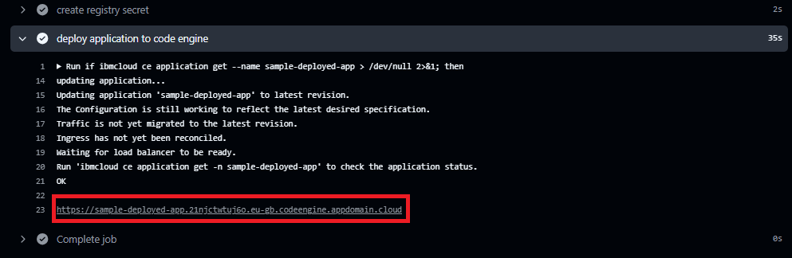

The App should look like this:


Congratulations! You just deployed your first application!


<br>
<br>
<br>
<br>
<br>
<br>
<br>
<br>
<br>
<br>
<br>
<br>
<br>
<br>
<br>
<br>
<br>
<br>
<br>
<br>
<br>
<br>
<br>
<br>
<br>
<br>
<br>
<br>
<br>
<br>
<br>
<br>
<br>
<br>
<br>
<br>
<br>
<br>
<br>
<br>
<br>
<br>
<br>
<br>
<br>
<br>
<br>
<br>
<br>
<br>
<br>
<br>
<br>
<br>
<br>
<br>
<br>
<br>
<br>
<br>


# End-to-End-DevOps
This repo contains code that is used to implement different stages of a DevOps journey, from application code to deployment on a target infrastructure. The code is intended to serve as an adoptable example for new entrants into DevOps and CI/CD. The code is arranged into 4 folders based on functionality and kept in this single repository to make it easy for beginners to follow through and recreate the deployment. In a real DevOps environment, the code will most likely be organized into different repos, following best practices on code separation. At the time of creating this project, maximum effort has been made to ensure that all the resources used in the deployment are free 😊, from cloud infrastructure to CI/CD tools. A more comprehensive article containing every step of the journey can be found here: [link-comming-soon](www.example.com). The article also breaks down key technical concepts in a non technical way to help beginners gain better understanding, so be sure to reference it if you find anything confusing.

## Code Organisation
### .github/workflows
This folder contains all the workflows that is used in this project. Workflows are yaml files containing all the steps(tasks) that we expect a runner to execute when a condition is met. The condition can be when you raise a pull request, push new code or click a manual run button. You can think of a runner as a cloud computer where we run our workflow steps. The files in the the folder are:
- `cicd.yml`<br>
Contains the CI/CD pipeline that builds and tests the application code, packages the code into a docker image, pushes the docker image to a private registry and deploys the image on IBM cloud
- `create_infra.yml`<br>
Contains a pipeline with terraform execution steps to create an IBM code engine project in which the application will be deployed
- `create_monitoring.yml`<br>
Contains a pipeline with terraform execution steps to create a monitoring instance on IBM cloud. The instance is used to collect metrics from the deployed app.
- `destroy_infra.yml`<br>
Contains terraform execution steps to destroy the IBM code engine project created using `create_infra.yml`. It is considered best practice to destroy cloud infrastructure when it is no longer in use.
- `destroy_monitoring`<br>
Contains terraform execution steps to destroy the monitoring instance created using `create_monitoring.yml`
### app
This folder contains a sample `hello world` app that is written in java with maven as the build tool. Building a code is the process of converting the code to an executable file that can run on a computer. The folder contains the following files and subfolder:
- `src`<br>
Sufolder containing the java source and test code for the app.
- `Dockerfile` <br>
Contains the information required to package the app into  a docker container. Packaging into a container or containerization is the process of packaging an app along with its dependencies so that it can run anywhere without the need to first install dependencies, i.e. we can run our java app without the neeed to first install java.
- `pom.xml`<br>
Contains a declaration of the dependencies and plugins required to successfully build the code. 
### infra
This folder contains the definition for the deployment infrastructure in terraform. Terraform is a language used for provisioning infrastructure resources through Infrastructure as Code (IaC). The files in the folder are:
- `provider.tf`<br>
Contains the definition for the cloud provider, IBM cloud in this case.
- `backend.tf`<br>
Declares the infrastructure workspace in terraform cloud. The workspace helps to hold the statefile which terraform uses to track the state of our resources and also holds the IBM cloud credentials which we cannot hardcode into our terraform files, following security best practices.
- `variables.tf`<br>
Declares the variables that we use in the rest of the terraform files. The variable values are stored in the infrastructure workspace in terraform cloud. They will be retrieved and inserted by terraform at run time.
- `code_engine.tf`<br>
Creates an IBM code engine project. IBM code engine is a serverless infrastructure offering from IBM for running containerised applications.
### monitoring
This folder contains the definition for the monitoring instance in terraform. The files in the folder are:
- `provider.tf`<br>
- `backend.tf`<br>
Declares the monitoring workspace in terraform cloud.
- `variables.tf`<br>
Variable values are stored in the monitoring workspace in terraform cloud.
- `monitor.tf`<br>
Creates a monitoring instance using an official module provided by IBM cloud. Modules are predefined terraform templates that help organise and standardise infrastructure as code.
## How to Create Your Own Deployment Using the Code in This Repo
There is an article that provides step by step guidance here: [link-comming-soon](www.example.com). If you are completely new to the described applications and concepts, you should follow the article for a more comprehensive guidance.
### Prerequisites
#### Setup your own Repository
- Fork this repository.
- Create a new environment called `dev` and add yourself as a reviewer.
#### Setup Doppler
Doppler is an application used for secret management.
- Create a free doppler account to store the secrets used in the GitHub actions workflows: https://www.doppler.com/.
- Create a service token that will be used to fetch the stored tokens.
- Add the service token as a secret named `DOPPLER_TOKEN` in actions variables in your own fork of the repository.
- Create a new project in doppler and name it `sample-project`. This should create three environments `dev`, `stage` and `prod`. You will store your secrets in the `dev` environment.
#### Setup IBM Cloud
IBM cloud is used to host the infrastructure for deployment and monitoring.
- Create a free IBM Cloud account: https://cloud.ibm.com/.
- Create an IBM Cloud API Key.
#### Setup Terraform Cloud
Terraform is used to provision resources on IBM Cloud using IaC. Terraform cloud is used as a remote backend to store state files and variables.
- Create a free Terraform cloud account: https://app.terraform.io/.
- Create an organization, `end-to-end-devops`
- Create two workspaces in the organization, `end-to-end-devops-infra` and `end-to-end-devops-monitoring`.
- In each workspace, create a terraform variable called `ibmcloud_api_key` and set the value to the IBM Cloud API Key you created in the above step.
- Create a user API token and add it to the `dev` environment in the doppler `sample-project`as `TERRAFORM_TOKEN`.
#### Setup SonarCloud
SonarQube is a code scanning tool for scanning application code for quality issues and security hotspots.
- Create a free SonarCloud account: https://sonarcloud.io/.
- Generate an access token and add it to the doppler `sample-project` as `SONARQUBE_TOKEN`.
#### Setup Snyk
Snyk is a code scanning tool used to scan for vulnerabilities in external dependencies and plugins used in an application code.
- Create a free Snyk account: https://app.snyk.io/.
- Generate an auth token and add it to the doppler `sample-project` as `SNYK_TOKEN`.
#### Setup Cloudsmith
Cloudsmith is a package repository for storing artefacts such as executable binaries and docker images.
- Create a free Cloudsmith account: https://app.cloudsmith.com/.
- Create a personal API key and add it to the doppler `sample-project` as `CLOUDSMITH_TOKEN`
- Create a new workspace named `sample-workspace`.
- Create a new repository named `sample-docker-repo`.
### Create Deployment infra structure
Manually trigger the `create_infra.yml` GitHub workflow to create an IBM Cloud code engine project. The workflow has a `plan` job and an `apply` job. Approve the apply job after reviewing the planned changes.
### Test, Biuld and Deploy
The `cicd.yml` workflow contains steps to test, build the app and deploy to the code engine project created in the step above. The jobs in the workflow are triggered when changes are made to the application code and pushed upstream, when a pull request is raised or when the workflow is triggered manually. There are three jobs; `build-and-test`(Continuous Integration), `containerize-and-deliver`(Continuous Delivery) and `deploy`(Continuous Deployment). The `build-and-test` job tests and builds the application code to confirm changes made to it did not break it. This job runs on all branches in the repository.
The `containerize-and-deliver` job packages the app into a docker container and pushes the container to an upstream docker repository. The `deploy` job deploys the application to the code engine project created earlier. Note that both the `containerize-and-deliver` and the `deploy` job are only run when there is a push to the main branch or when the workflow is triggered from the main branch. After the deploy job is run, the job run will output a URL that you can visit and see the deployed app.
### Monitor the deployed application
Manually trigger the `create_monitoring.yml` GitHub workflow to create an IBM Cloud monitoring instance. The workflow only creates the instance but doesn't enable Platform Metrics. IBM cloud does not support enabling Platform Metrics via terraform or any other API call at the time this project was created. After creating the instance, login to IBM cloud, under observability -> monitoring -> monitoring instances, you will see an instance named `cloud-monitoring-*`. Enable platform metrics and set location to the location of the app. Once setup is complete, wait for some minutes and you should be able to see information about the deployed app in the monitoring instance dashboard.
## House Cleaning.
One of the best practices of DevOps is to clean up after resources are no longer needed. You can experiment with changing the app code or even play around with the ci/cd pipeline based on your level of experience, but once you are done with expierimenting, destroy the created cloud resources by doing the following:
- Run `destroy_infra.yml` to destroy the code engine project
- Run `destroy_monitoring.yml` to destroy the monitoring instance.

> [!CAUTION]
> _IBM Cloud has a concept called reclaimations. This means that destroyed resources are kept in a state where they can be reclaimed for seven days._
> _During the reclaimation period, you cannot create resources with the same name as resources in the reclaimation state._
> _To create resources with the same name, you need to login to IBM Cloud, go to the section where the resources reside and delete reclaimations._
> _In other words, if you run and approve `destroy_infra.yml` (or `destroy_monitoring.yml`), running `create_infra.yml` (or `create_monitoring.yml`) will fail unless you delete reclaimations or wait for seven days._

